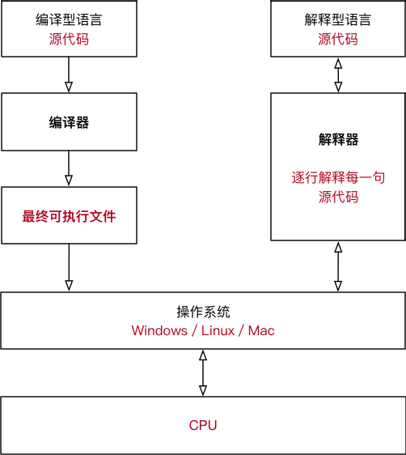

我们编写的源代码是人类语言，我们自己能够轻松理解；但是对于计算机硬件（CPU），源代码就是天书，根本无法执行，计算机只能识别某些特定的二进制指令，在程序真正运行之前必须将源代码转换成二进制指令。

所谓的二进制指令，也就是机器码，是 CPU 能够识别的硬件层面的“代码”，简陋的硬件（比如古老的单片机）只能使用几十个指令，强大的硬件（PC 和智能手机）能使用成百上千个指令。

然而，究竟在什么时候将源代码转换成二进制指令呢？不同的编程语言有不同的规定：
- 有的编程语言要求必须提前将所有源代码一次性转换成二进制指令，也就是生成一个可执行程序（Windows 下的 .exe），比如C语言、C++、Golang、Pascal（Delphi）、汇编等，这种编程语言称为编译型语言，使用的转换工具称为编译器。
- 有的编程语言可以一边执行一边转换，需要哪些源代码就转换哪些源代码，不会生成可执行程序，比如 Python、JavaScript、PHP、Shell、MATLAB 等，这种编程语言称为解释型语言，使用的转换工具称为解释器。

简单理解，编译器就是一个“翻译工具”，类似于将中文翻译成英文、将英文翻译成俄文。但是，翻译源代码是一个复杂的过程，大致包括词法分析、语法分析、语义分析、性能优化、生成可执行文件等五个步骤，期间涉及到复杂的算法和硬件架构。解释器与此类似，有兴趣的读者请参考《编译原理》一书，本文不再赘述。

> Java 和 C# 是一种比较奇葩的存在，它们是半编译半解释型的语言，源代码需要先转换成一种中间文件（字节码文件），然后再将中间文件拿到虚拟机中执行。Java 引领了这种风潮，它的初衷是在跨平台的同时兼顾执行效率；C# 是后来的跟随者，但是 C# 一直止步于 Windows 平台，在其它平台鲜有作为。

    
    图 1 编译型语言和解释型语言的执行流程

那么，编译型语言和解释型语言各有什么特点呢？它们之间有什么区别？
## 编译型语言
对于编译型语言，开发完成以后需要将所有的源代码都转换成可执行程序，比如 Windows 下的.exe文件，可执行程序里面包含的就是机器码。只要我们拥有可执行程序，就可以随时运行，不用再重新编译了，也就是“一次编译，无限次运行”。

在运行的时候，我们只需要编译生成的可执行程序，不再需要源代码和编译器了，所以说编译型语言可以脱离开发环境运行。

编译型语言一般是不能跨平台的，也就是不能在不同的操作系统之间随意切换。

编译型语言不能跨平台表现在两个方面：
## 1) 可执行程序不能跨平台
可执行程序不能跨平台很容易理解，因为不同操作系统对可执行文件的内部结构有着截然不同的要求，彼此之间也不能兼容。不能跨平台是天经地义，能跨平台反而才是奇葩。

比如，不能将 Windows 下的可执行程序拿到 Linux 下使用，也不能将 Linux 下的可执行程序拿到 Mac OS 下使用（虽然它们都是类 Unix 系统）。

另外，相同操作系统的不同版本之间也不一定兼容，比如不能将 x64 程序（Windows 64 位程序）拿到 x86 平台（Windows 32 位平台）下运行。但是反之一般可行，因为 64 位 Windows 对 32 位程序作了很好的兼容性处理。
## 2) 源代码不能跨平台
不同平台支持的函数、类型、变量等都可能不同，基于某个平台编写的源代码一般不能拿到另一个平台下编译。我们以C语言为例来说明。

【实例1】在C语言中要想让程序暂停可以使用“睡眠”函数，在 Windows 平台下该函数是 Sleep()，在 Linux 平台下该函数是 sleep()，首字母大小写不同。其次，Sleep() 的参数是毫秒，sleep() 的参数是秒，单位也不一样。

以上两个原因导致使用暂停功能的C语言程序不能跨平台，除非在代码层面做出兼容性处理，非常麻烦。

【实例2】虽然不同平台的C语言都支持 long 类型，但是不同平台的 long 的长度却不同，例如，Windows 64 位平台下的 long 占用 4 个字节，Linux 64 位平台下的 long 占用 8 个字节。

我们在 Linux 64 位平台下编写代码时，将 0x2f1e4ad23 赋值给 long 类型的变量是完全没有问题的，但是这样的赋值在 Windows 平台下就会导致数值溢出，让程序产生错误的运行结果。

让人苦恼的，这样的错误一般不容易察觉，因为编译器不会报错，我们也记不住不同类型的取值范围。
# 解释型语言
对于解释型语言，每次执行程序都需要一边转换一边执行，用到哪些源代码就将哪些源代码转换成机器码，用不到的不进行任何处理。每次执行程序时可能使用不同的功能，这个时候需要转换的源代码也不一样。

因为每次执行程序都需要重新转换源代码，所以解释型语言的执行效率天生就低于编译型语言，甚至存在数量级的差距。计算机的一些底层功能，或者关键算法，一般都使用 C/C++ 实现，只有在应用层面（比如网站开发、批处理、小工具等）才会使用解释型语言。

在运行解释型语言的时候，我们始终都需要源代码和解释器，所以说它无法脱离开发环境。

当我们说“下载一个程序（软件）”时，不同类型的语言有不同的含义：
- 对于编译型语言，我们下载到的是可执行文件，源代码被作者保留，所以编译型语言的程序一般是闭源的。
- 对于解释型语言，我们下载到的是所有的源代码，因为作者不给源代码就没法运行，所以解释型语言的程序一般是开源的。

相比于编译型语言，解释型语言几乎都能跨平台，“一次编写，到处运行”是真是存在的，而且比比皆是。那么，为什么解释型语言就能快平台呢？

这一切都要归功于解释器！

我们所说的跨平台，是指源代码跨平台，而不是解释器跨平台。解释器用来将源代码转换成机器码，它就是一个可执行程序，是绝对不能跨平台的。

官方需要针对不同的平台开发不同的解释器，这些解释器必须要能够遵守同样的语法，识别同样的函数，完成同样的功能，只有这样，同样的代码在不同平台的执行结果才是相同的。

你看，解释型语言之所以能够跨平台，是因为有了解释器这个中间层。在不同的平台下，解释器会将相同的源代码转换成不同的机器码，解释器帮助我们屏蔽了不同平台之间的差异。
# 关于 Python
Python 属于典型的解释型语言，所以运行 Python 程序需要解释器的支持，只要你在不同的平台安装了不同的解释器，你的代码就可以随时运行，不用担心任何兼容性问题，真正的“一次编写，到处运行”。

Python 几乎支持所有常见的平台，比如 Linux、Windows、Mac OS、Android、FreeBSD、Solaris、PocketPC 等，你所写的 Python 代码无需修改就能在这些平台上正确运行。也就是说，Python 的可移植性是很强的。