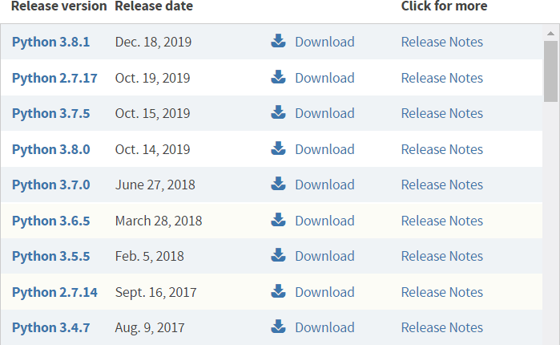
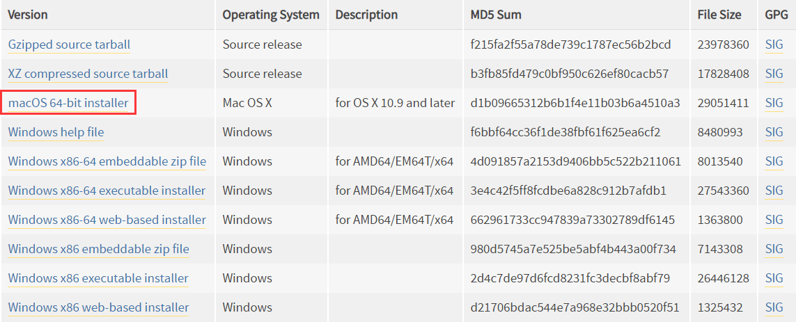
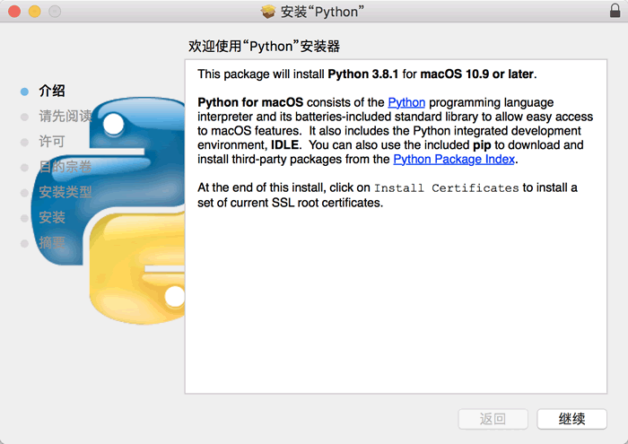
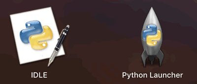

最新版的 Mac OS X 也会默认自带 Python 2.x。

我们可以在终端（Terminal）窗口中输入python命令来检测是否安装了 Python 开发环境，以及安装了哪个版本，如下所示：
```bash
c.biancheng.net:~ mozhiyan$ python
Python 2.7.10 (default, Jul 30 2016, 18:31:42)
[GCC 4.2.1 Compatible Apple LLVM 8.0.0 (clang-800.0.34)] on darwin
Type "help", "copyright", "credits" or "license" for more information.
```
可以看到，python命令能够正常运行，并输出了 Python 的版本信息，这表明当前的 Mac OS X 系统已经自带了 Python 2.7.10。

python命令默认指向 Python 2.x 开发环境，如果想检测当前 Mac OS X 是否安装了 Python 3.x，可以在终端（Terminal）窗口中输入python3命令：
如果系统提示command not found，则说明没有安装 Python 3.x；
如果python3命令运行成功，并显示出版本信息，则说明已经安装了 Python 3.x。

对于没有安装 Python 3.x 的 Mac OS X，想要安装也非常简单，用户只需要下载安装包，然后一直“下一步”即可，这和 Windows 安装 Python 的过程是非常类似的。
Mac OS X 安装 Python 3.x
Python 官方下载地址：https://www.python.org/downloads/

打开链接，可以看到各个版本的 Python：

<div class='img_content'>
    
    <span>图 1 Python 下载页面截图</span>
</div>


点击上图中的版本号或者“Download”按钮进入对应版本的下载页面，滚动到最后即可看到各个平台的 Python 安装包。

<div class='img_content'>
    
    <span>图 2 各个平台的 Python 安装包</span>
</div>

macOS 64-bit installer即为 Mac OS X 系统的 Python 安装包。点击该链接，下载完成后得到一个 python-3.8.1-macosx10.9.pkg 安装包。

双击 python-3.8.1-macosx10.9.pkg 就进入了 Python 安装向导，然后按照向导一步一步向下安装，一切保持默认即可。

<div class='img_content'>
    
    <span>Mac OS X下的Python安装向导</span>
</div>

安装完成以后，你的 Mac OS X 上将同时存在 Python 3.x 和 Python 2.x 的运行环境，在终端（Terminal）输入python命令将进入 Python 2.x 开发环境，在终端
（Terminal）输入python3命令将进入  Python 3.x 开发环境。
```bash
c.biancheng.net:~ mozhiyan$ python3
Python 3.8.1 (v3.8.1:1b293b6006, Dec 18 2019, 14:08:53)
[Clang 6.0 (clang-600.0.57)] on darwin
Type "help", "copyright", "credits" or "license" for more information.
```

与 Windows 系统类似，Mac OS 下的 Python 3.x 也会自带 IDLE 简易开发工具，你可以在程序列表中找到它。

<div class='img_content'>
    
    <span>安装完成以后的程序列表</span>
</div>
