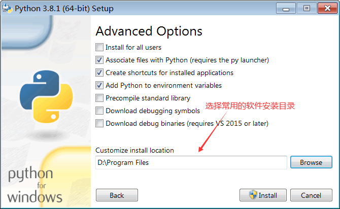

在 Windows 上安装 Python 和安装普通软件一样简单，下载安装包以后猛击“下一步”即可。

Python 安装包下载地址：https://www.python.org/downloads/

打开该链接，可以看到有两个版本的 Python，分别是 Python 3.x 和 Python 2.x，如下图所示：

    
    图 1 Python 下载页面截图（包含 Python 2.x 和 Python 3.x 两个版本）

Python 3.x 是一次重大升级，为了避免引入历史包袱，Python 3.x 没有考虑与 Python 2.x 的兼容性，这导致很多已有的项目无法顺利升级 Python 3.x，只能继续使用 Python 2.x，而大部分刚刚起步的新项目又使用了 Python 3.x，所以目前官方还需要维护这两个版本的 Python。

初学者直接使用 Python 3.x。截止到目前（2020），Python 的最新版本是 3.8.x，我们就以该版本为例演示 Windows 下的 Python 安装过程。

点击上图中的版本号或者“Download”按钮进入对应版本的下载页面，滚动到最后即可看到各个平台的 Python 安装包。

    
    图 2 各个平台的 Python 安装包

对前缀的说明：
- 以Windows x86-64开头的是 64 位的 Python 安装程序；
- 以Windows x86开头的是 32 位的 Python 安装程序。

对后缀的说明：
- embeddable zip file表示.zip格式的绿色免安装版本，可以直接嵌入（集成）到其它的应用程序中；
- executable installer表示.exe格式的可执行程序，这是完整的离线安装包，一般选择这个即可；
- web-based installer表示通过网络安装的，也就是说下载到的是一个空壳，安装过程中还需要联网下载真正的 Python 安装包。

这里选择的是“Windows x86-64 executable installer”，也即 64 位的完整的离线安装包。

双击下载得到的 python-3.8.1-amd64.exe，就可以正式开始安装 Python 了，如图3所示。

    
    图 3 Python 安装向导

请尽量勾选Add Python 3.8 to PATH，这样可以将 Python 命令工具所在目录添加到系统 Path 环境变量中，以后开发程序或者运行 Python 命令会非常方便。

Python 支持两种安装方式，默认安装和自定义安装：
- 默认安装会勾选所有组件，并安装在 C 盘；
- 自定义安装可以手动选择要安装的组件，并安装到其它盘符。

这里我们选择自定义安装，将 Python 安装到常用的目录，避免C盘文件过多。点击“Customize installation”进行入下一步，选择要安装的 Python 组件。

    
    图 4 选择要安装的 Python 组件

没有特殊要求的话，保持默认即可，也就是全部勾选。

点击“Next”继续，选择安装目录。

    
    图 5 选择安装目录

选择好你常用的安装目录，点击“Install”，等待几分钟就可以完成安装。

安装完成以后，打开 Windows 的命令行程序（命令提示符），在窗口中输入python命令（注意字母p是小写的），如果出现 Python 的版本信息，并看到命令提示符>>>，就说明安装成功了，如下图所示。

    
    图 6 运行 python 命令

运行 python 命令启动的是 python 交互式编程环境，我们可以在>>>后面输入代码，并立即看到执行结果，请看下面的例子。

    
    图 7 在 Python 交互式环境中编写代码

按下Ctrl+Z快捷键，或者输入 exit() 命令即可退出交互式编程环境，回到 Windows 命令行程序。
关于 IDLE
IDLE 是 Python 自带的简易开发环境，安装完成以后，在 Windows 开始菜单中找到Python 3.8文件夹，在这里可以看到 IDLE 工具:

    
    图 8 Python IDLE 简易开发环境

