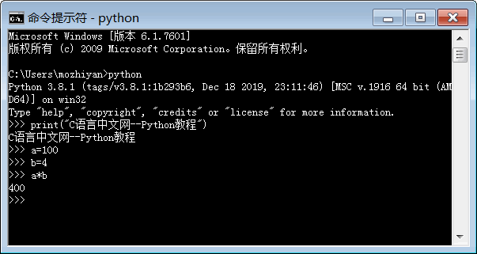
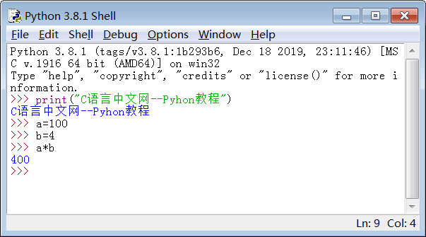
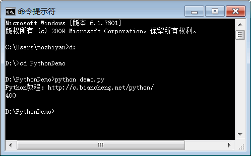
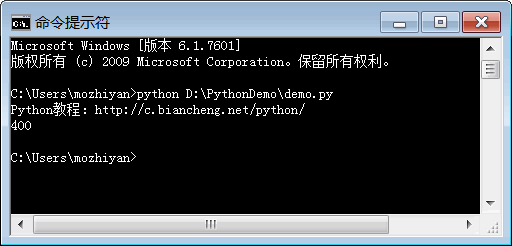

Python 是一种解释型的脚本编程语言，这样的编程语言一般支持两种代码运行方式：
-  交互式编程
在命令行窗口中直接输入代码，按下回车键就可以运行代码，并立即看到输出结果；执行完一行代码，你还可以继续输入下一行代码，再次回车并查看结果……整个过程就好像我们在和计算机对话，所以称为交互式编程。
-  编写源文件
创建一个源文件，将所有代码放在源文件中，让解释器逐行读取并执行源文件中的代码，直到文件末尾，也就是批量执行代码。这是最常见的编程方式，也是我们要重点学习的。

本节我们将详细介绍以上两种编程方式。
# Python 交互式编程
一般有两种方法进入 Python 交互式编程环境，第一种方法是在命令行工具或者终端（Terminal）窗口中输入python命令，看到>>>提示符就可以开始输入代码了，如下所示：
<div class='img_content'>
    
    <span>图 1 使用python命令进入交互式编程环境</span>
</div>


第二种进入 Python 交互式编程环境的方法是，打开 Python 自带的 IDLE 工具，默认就会进入交互式编程环境，如下所示：
<div class='img_content'>
    
    <span>图 2 打开 IDLE 工具进入交互式编程环境</span>
</div>

IDLE 支持代码高亮，看起来更加清爽，所以推荐使用 IDLE 编程。

实际上，你可以在交互式编程环境中输入任何复杂的表达式（包括数学计算、逻辑运算、循环语句、函数调用等），Python 总能帮你得到正确的结果。这也是很多非专业程序员喜欢 Python 的一个原因：即使你不是程序员，但只要输入想执行的运算，Python 就能告诉你正确的答案。

从这个角度来看，Python 的交互式编程环境相当于一个功能无比强大的“计算器”，比 Windows 、Mac OS X 系统自带的计算器的功能强大多了。
# 编写 Python 源文件
交互式编程只是用来玩玩而已，真正的项目开发还是需要编写源文件的。

Python 源文件是一种纯文本文件，内部没有任何特殊格式，你可以使用任何文本编辑器打开它，比如：
Windows 下的记事本程序；
Linux 下的 Vim、gedit 等；
Mac OS 下的 TextEdit 工具；
跨平台的 Notepad++、EditPlus、UltraEdit 等；
更加专业和现代化的 VS Code 和 Sublime Text（也支持多种平台）。

注意，不能使用写字板、Word、WPS 等排版工具编写 Python 源文件，因为排版工具一般都有内置的特殊格式或者特殊字符，这些会让代码变得“乱七八糟”，不能被 Python 解释器识别。
## 源文件的后缀
Python 源文件的后缀为.py。任何编程语言的源文件都有特定的后缀，例如：
C语言源文件的后缀是.c；
C++源文件的后缀是.cpp；
JavaScript 源文件的后缀是.js；
C# 源文件的后缀是.cs；
Java 源文件的后缀是.java。

后缀只是用来区分不同的编程语言，并不会导致源文件的内部格式发生变化，源文件还是纯文本的。编译器（解释器）、编辑器和用户（程序员）都依赖后缀区分当前源文件属于哪种编程语言。
## 源文件的编码格式
Python 源文件是一种纯文本文件，会涉及编码格式的问题，也就是使用哪种编码来存储源代码。

Python 3.x 已经将 UTF-8 作为默认的源文件编码格式，所以推荐大家使用专业的文本编辑器，比如 Sublime Text、VS Code、Vim、Notepad++ 等，它们都默认支持 UTF-8 编码。

UTF-8 是跨平台的，国际化的，编程语言使用 UTF-8 是大势所趋。

如果你对编码格式不了了解，请猛击下面的链接学习：
ASCII 编码，将英文存储到计算机
GB2312 编码和 GBK 编码，将中文存储到计算机
Unicode 字符集，将全世界的文字存储到计算机
## 运行源文件
使用编辑器（我习惯使用 Sublime Text）创建一个源文件，命名为 demo.py，并输入下面的代码：

```python
print("Python教程：辰飞IT职业教育")
a = 100
b = 4
print(a*b)
```
输入完成以后注意保存。

运行 Python 源文件有两种方法：

1) 使用 Python 自带的 IDLE 工具运行源文件。

通过file -> open菜单打开 demo.py 源文件，然后在源文件中的菜单栏中选择Run->Run Module，或者按下 F5 快捷键，就可以执行源文件中的代码了。
<div class='img_content'>
    
    <span>图 3 运行效果截图</span>
</div>

更多关于 IDLE 的使用方法，请转到《Python IDLE使用方法》。

2) 在命令行工具或者终端（Terminal）中运行源文件。

进入命令行工具或者终端（Terminal），切换到 demo.txt 所在的目录，然后输入下面的命令就可以运行源文件：
python demo.py

运行完该命令，可以立即看到输出结果，如下图所示。
<div class='img_content'>
    
    <span>图 4 在 WIndows 命令行工具中运行 Python 源文件</span>
</div>
 


这里简单介绍一下 python 命令，它的语法非常简单，其基本格式如下：
python <源文件路径>

这里的源文件路径，可以是自盘符（C盘、D盘）开始的绝对路径，比如D:\PythonDemo\demo.py；也可以在执行 python 命令之前，先进入源文件所在的目录，然后只写文件名，也就是使用相对路径。

图4演示的是使用相对路径，下面我们再演示一下使用绝对路径：
<div class='img_content'>
    
    <span>图 5 python 命令使用绝对路径</span>
</div>
 
需要注意的是，Windows 系统不区分大小写，在 Windows 平台上输入源文件路径时可以不用注意大小写。但是类 Unix 系统（Mac OS X、Linux 等）都是区分大小写，在这些平台上输入 Python 源文件路径时一定要注意大小写问题。