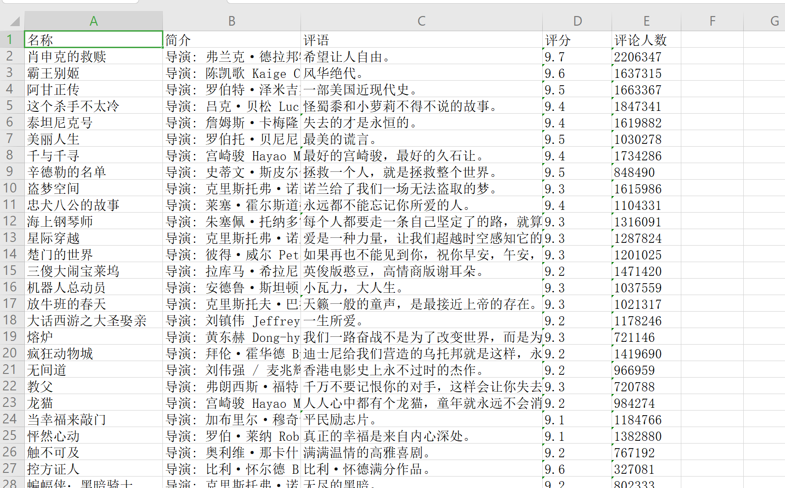
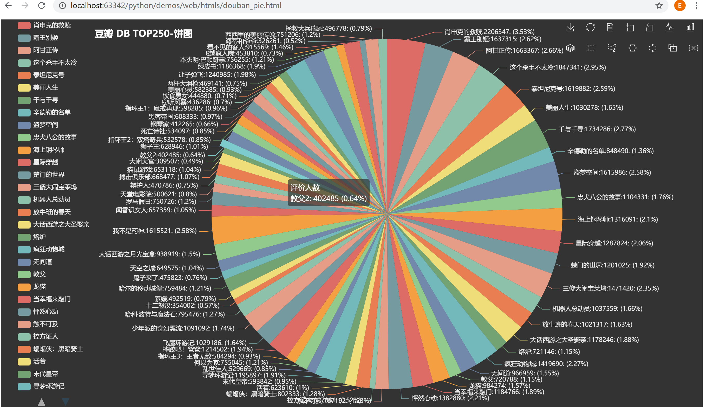

<center><h1>使用python读取excel数据 & 图表制作<h1></center>

## 一：使用python读取excel数据

**使用 第三方库 xlrd 读取 excel数据：**
```python

import xlrd

# 读取表格
data = xlrd.open_workbook("excels/douban_top250.xlsx")

# 获取表格的sheets
table = data.sheets()[0]

```


## 二：将excel中的数据，进行图表可视化展示

**使用 第三方库 pyecharts 进行图表可视化展示：**

```python

"""
豆瓣，饼图
https://movie.douban.com/top250
"""

import xlrd
from pyecharts.charts import Pie
import pyecharts.options as opts
from pyecharts.globals import ThemeType

# 读取表格
data = xlrd.open_workbook("excels/douban_top250.xlsx")

# 获取表格的sheets
table = data.sheets()[0]

xdata = []
ydata = []
for i in range(1, table.nrows - 180):
    xdata.append(table.row_values(i)[0])
    ydata.append(table.row_values(i)[4])

print(xdata)
print(ydata)

data_pair_temp = list(zip(xdata, ydata))

# basic
# 可以赋予对象，也可不必，因为渲染是通过  .render() 语句完成的
pie = (
    Pie(
        opts.InitOpts(

            # 图表尺寸
            width='1350px',
            height='750px',

            # 使用主题需导入ThemeType
            # 主题：LIGHT,DARK,CHALK,ESSOS,INFOGRAPHIC...
            theme=ThemeType.DARK,

            # 网页标题，图表保存为网页时起效
            page_title='豆瓣TOP250-饼图',

            # 图表背景颜色
            # bg_color='green',

            js_host="http://localhost:63342/python/demos/web/resource/js/",  # 本地js路径
        ))  # 实例化
        .add(
        series_name="评价人数",  # 系列名称
        data_pair=data_pair_temp,  # 馈入数据
        # rosetype="radius",
        radius="90%",  # 饼图半径比例
        center=["55%", "50%"],  # 饼图中心坐标
        label_opts=opts.LabelOpts(is_show=True, position="center", formatter="{b}:{c}: ({d}%)")  # 标签位置
    )
        .set_global_opts(
        title_opts=opts.TitleOpts(
            title="豆瓣 DB TOP250-饼图",
            pos_left="left",
            padding=[20, 0, 0, 180],
            title_textstyle_opts=opts.TextStyleOpts(color="#fff"),
        ),
        legend_opts=opts.LegendOpts(
            is_show=True,
            type_="scroll",
            pos_left="2%",
            orient="vertical"),
        toolbox_opts=opts.ToolboxOpts(
            # 是否显示该工具
            is_show=True,
            item_gap=20
        )
    )
        .set_series_opts(
        label_opts=opts.LabelOpts(formatter="{b}:{c}: ({d}%)"),
        tooltip_opts=opts.TooltipOpts(
            trigger="item", formatter="{a} <br/>{b}: {c} ({d}%)"
        ),
    )  # 标签颜色
)

pie.render("web/htmls/douban_pie.html")  # 渲染文件


```

案例中使用的excel文件（douban_top250.xlsx），数据内容格式入下图：

<div class='img_content'>
    
    <span>图 2 douban_top250.xlsx数据格式</span>
</div>


可视化结果：

<div class='img_content'>
    
    <span>图 2 豆瓣TOP250 可视化结果</span>
</div>