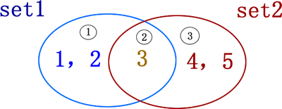

Python set 集合最常用的操作是向集合中添加、删除元素，以及集合之间做交集、并集、差集等运算，

## 向 set 集合中添加元素

set 集合中添加元素，可以使用 set 类型提供的 add() 方法实现，该方法的语法格式为：

> setname.add(element)

其中，setname 表示要添加元素的集合，element 表示要添加的元素内容。

需要注意的是，使用 add() 方法添加的元素，只能是数字、字符串、元组或者布尔类型（True 和 False）值，不能添加列表、字典、集合这类可变的数据，否则 Python 解释器会报 TypeError 错误。例如：
```python
a = {1,2,3}
a.add((1,2))
print(a)
a.add([1,2])
print(a)
```
运行结果为：
```consle
{(1, 2), 1, 2, 3}
Traceback (most recent call last):
  File "C:/work/cf/python/TestEdu/t3.py", line 4, in <module>
    a.add([1,2])
TypeError: unhashable type: 'list'
```
## 从set集合中删除元素
删除现有 set 集合中的指定元素，可以使用 remove() 方法，该方法的语法格式如下：
> setname.remove(element)

使用此方法删除集合中元素，需要注意的是，如果被删除元素本就不包含在集合中，则此方法会抛出 KeyError 错误，例如：
```python
a = {1,2,3}
a.remove(1)
print(a)
a.remove(1)
print(a)
```
运行结果为：
```consle
{2, 3}
Traceback (most recent call last):
  File "C:/work/cf/python/TestEdu/t3.py", line 4, in <module>
    a.remove(1)
KeyError: 1
```

上面程序中，由于集合中的元素 1 已被删除，因此当再次尝试使用 remove() 方法删除时，会引发 KeyError 错误。

如果我们不想在删除失败时令解释器提示 KeyError 错误，还可以使用 discard() 方法，此方法和 remove() 方法的用法完全相同，唯一的区别就是，当删除集合中元素失败时，此方法不会抛出任何错误。

例如：
```python
a = {1,2,3}
a.remove(1)
print(a)
a.discard(1)
print(a)
```
运行结果为：
```consle
{2, 3}
{2, 3}
```

## set集合做交集、并集、差集运算
集合最常做的操作就是进行交集、并集、差集以及对称差集运算，首先普及一下各个运算的含义。

<div class='img_content'>
    
    <span>图 1 集合示意图</span>
</div>

图 1 中，有 2 个集合，分别为 set1={1,2,3} 和 set2={3,4,5}，它们既有相同的元素，也有不同的元素。以这两个集合为例，分别做不同运算的结果如表 1 所示。

|  运算操作   | Python运算符  | 含义| 例子 |
|  ----  | ----  |----  |----  |
|交集	|&	|取两集合公共的元素	| set1 & set2 <br> 结果：<br>{3}|
|并集	| &#124;	|取两集合全部的元素	|set1 &#124; set2<br> 结果：<br>{1,2,3,4,5}|
|差集	|-	|取一个集合中另一集合没有的元素	| set1 - set2<br> 结果：<br>{1,2}|
|对称差集	|^	|	取集合 A 和 B 中不属于 A&B 的元素（即不在A存在也不在B存在）	| set1 ^ set2<br> 结果：<br>{1,2,4,5}|


表 1 Python set集合运算