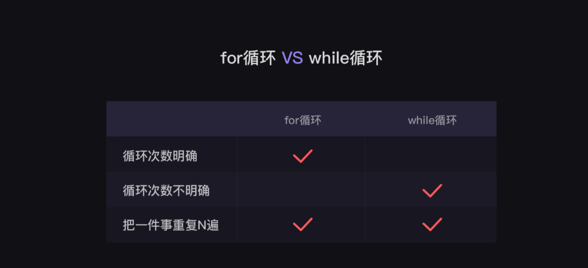

<div class='img_content'>
    
    <span>图 1 for循环 VS while循环</span>
</div>


Python中for循环和while循环本质上是没有区别的，但是在实际应用上，针对性不太一样。

## for
for主要应用在遍历中，比如:

**案例一**
```python
for i in range(10):
    print(i)
```
打印结果为：
```consle
0 1 2 3 4 5 6 7 8 9 
```
**案例二**
```python
list1 = [1,2,"a”]
for i in list1:
    print(i)
```
打印结果为：
```consle
1
2
a
```

## while

while循环很少进行遍历使用（语句过多，没有for方便），while主要用于判断符合条件下循环，比如：

```python
i = 0
while True:
    if i<3:
        print(i)
        i += 1
    else：
        print("i>=3啦!")
        break
```

运行结果：当i叠加到3前，依次打印i的值，当i等于3的时候判断语句不成立，执行else语句，跳出while循环

打印结果：

```consle
0
1
2
```