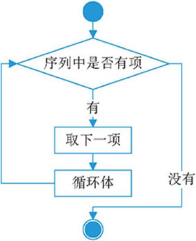

Python 中的循环语句有 2 种，分别是 while 循环和 for 循环，前面章节已经对 while 做了详细的讲解，本节给大家介绍 for 循环，它常用于遍历字符串、列表、元组、字典、集合等序列类型，逐个获取序列中的各个元素。

for 循环的语法格式如下：
```python
for 迭代变量 in 字符串|列表|元组|字典|集合：
    代码块
```

格式中，迭代变量用于存放从序列类型变量中读取出来的元素，所以一般不会在循环中对迭代变量手动赋值；代码块指的是具有相同缩进格式的多行代码（和 while 一样），由于和循环结构联用，因此代码块又称为循环体。

for 循环语句的执行流程如图 1 所示。

<div class='img_content'>
    
    <span>图 1 for 循环语句的执行流程图</span>
</div>


下面的程序演示了 for 循环的具体用法：
```python
add = "https://doc-py.she-tech.cn/"
#for循环，遍历 add 字符串
for ch in add:
    print(ch,end="")
```
运行结果为：
```consle
https://doc-py.she-tech.cn/
```

可以看到，使用 for 循环遍历  add 字符串的过程中，迭代变量 ch 会先后被赋值为 add 字符串中的每个字符，并代入循环体中使用。只不过例子中的循环体比较简单，只有一行输出语句。
## Python for循环的具体应用

**for 循环进行数值循环**

在使用 for 循环时，最基本的应用就是进行数值循环。比如说，想要实现从 1 到 100 的累加，可以执行如下代码：
```python
print("计算 1+2+...+100 的结果为：")
#保存累加结果的变量
result = 0
#逐个获取从 1 到 100 这些值，并做累加操作
for i in range(101):
    result += i
print(result)
```
运行结果为：
```consle
计算 1+2+...+100 的结果为：
5050

```
上面代码中，使用了 range() 函数，此函数是 Python 内置函数，用于生成一系列连续整数，多用于 for 循环中。
有关 range() 函数的具体用法，可阅读《Python range()》一节，值得一提的是，Python 2.x 中除提供 range() 函数外，还提供了一个 xrange() 函数，它可以解决 range() 函数不经意间耗掉所有可用内存的问题。但在 Python 3.x 中，已经将 xrange() 更名为 range() 函数，并删除了老的 xrange() 函数。

**for循环遍历列表和元组**

当用 for 循环遍历 list 列表或者 tuple 元组时，其迭代变量会先后被赋值为列表或元组中的每个元素并执行一次循环体。

下面程序使用 for 循环对列表进行了遍历：
```python
my_list = [1,2,3,4,5]
for ele in my_list:
    print('ele =', ele)
```
程序执行结果为：
```python
ele = 1
ele = 2
ele = 3
ele = 4
ele = 5
```

**for 循环遍历字典**

在使用 for 循环遍历字典时，经常会用到和字典相关的 3 个方法，即 items()、keys() 以及 values()，它们各自的用法已经在前面章节中讲过，这里不再赘述。当然，如果使用 for 循环直接遍历字典，则迭代变量会被先后赋值为每个键值对中的键。

例如：
```python
my_dic = {'python':"http://doc-py.she-tech.cn/",\
          'shell':"http://doc-py.she-tech.cn/",\
          'java':"http://doc-py.she-tech.cn/"}
for ele in my_dic:
    print('ele =', ele)
```
程序执行结果为：
```consle
ele = python
ele = shell
ele = java
```

因此，直接遍历字典，和遍历字典 keys() 方法的返回值是相同的。

除此之外，我们还可以遍历字典 values()、items() 方法的返回值。例如：
```python
my_dic = {'python':"http://doc-py.she-tech.cn/",\
          'shell':"http://doc-py.she-tech.cn/",\
          'java':"http://doc-py.she-tech.cn/"}
for ele in my_dic.items():
    print('ele =', ele)
```
程序执行结果为：
```consle
ele = ('python', 'http://doc-py.she-tech.cn/')
ele = ('shell', 'http://doc-py.she-tech.cn/')
ele = ('java', 'http://doc-py.she-tech.cn/')
```