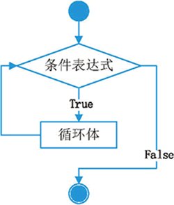

Python 中，while 循环和 if 条件分支语句类似，即在条件（表达式）为真的情况下，会执行相应的代码块。不同之处在于，只要条件为真，while 就会一直重复执行那段代码块。

while 语句的语法格式如下：

```python
while 条件表达式：
    代码块

```

这里的代码块，指的是缩进格式相同的多行代码，不过在循环结构中，它又称为循环体。

while 语句执行的具体流程为：首先判断条件表达式的值，其值为真（True）时，则执行代码块中的语句，当执行完毕后，再回过头来重新判断条件表达式的值是否为真，若仍为真，则继续重新执行代码块...如此循环，直到条件表达式的值为假（False），才终止循环。

while 循环结构的执行流程如图 1 所示。

<div class='img_content'>
    
    <span>图 1 while 循环语句执行流程示意图</span>
</div>


例如，打印 1~100 的所有数字，就可以使用 while 循环，实现代码如下：
```python
# 循环的初始化条件
num = 1
# 当 num 小于100时，会一直执行循环体
while num < 100 :
    print("num=", num)
    # 迭代语句
    num += 1
print("循环结束!")
```
运行程序会发现，程序只输出了 1~99，却没有输出 100。这是因为，当循环至 num 的值为 100 时，此时条件表达式为假（100<100），当然就不会再去执行代码块中的语句，因此不会输出 100。

注意，在使用 while 循环时，一定要保证循环条件有变成假的时候，否则这个循环将成为一个死循环。所谓死循环，指的是无法结束循环的循环结构，例如将上面 while 循环中的num += 1代码注释掉，再运行程序你会发现，Python 解释器一直在输出"num= 1"，永远不会结束（因为 num<100 一直为 True），除非我们强制关闭解释器。

再次强调，只要位于 while 循环体中的代码，其必须使用相同的缩进格式（通常缩进 4 个空格），否则 Python 解释器会报 SyntaxError 错误（语法错误）。例如，将上面程序中num+=1语句前移一个空格，再次执行该程序，此时 Python 解释器就会报 SyntaxError 错误。

除此之外，while 循环还常用来遍历列表、元组和字符串，因为它们都支持通过下标索引获取指定位置的元素。例如，下面程序演示了如何使用 while 循环遍历一个字符串变量：
```python
my_char="http://doc-py.she-tech.cn/"
i = 0;
while i<len(my_char):
    print(my_char[i],end="")
    i = i + 1
```
程序执行结果为：
```python
http://doc-py.she-tech.cn/
```